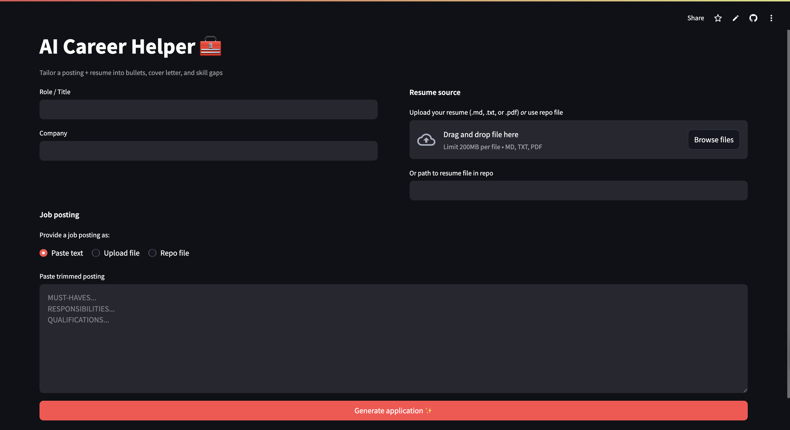
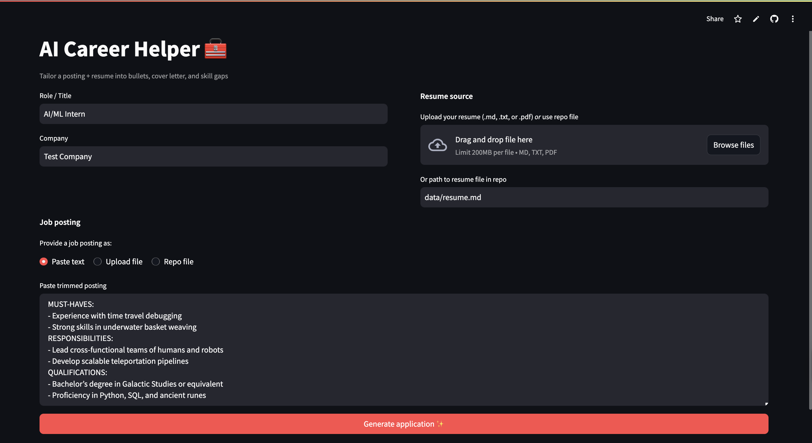
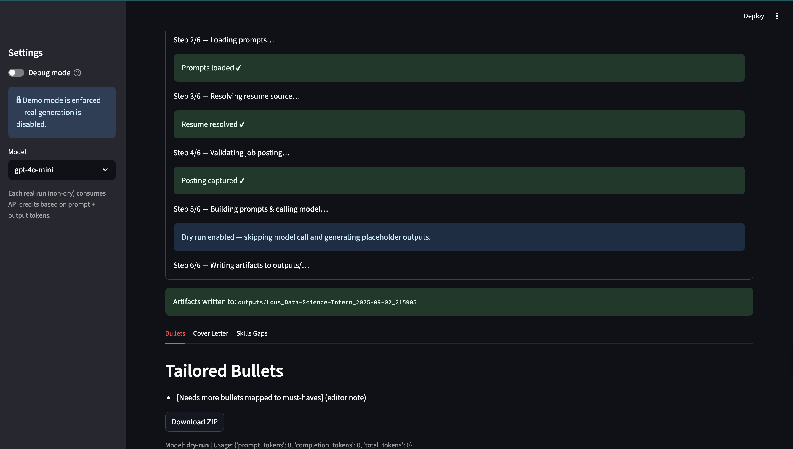

# AI Career Helper
[Try it on Streamlit](https://ai-career-assistant.streamlit.app/)
Tailor your resume + job postings into role-specific **bullets, cover letters, and skills gaps** using OpenAI.

---

## Features
- **Resume → Tailored Application**: Generate bullets, a ~325-word cover letter, and 2–5 skills gaps.  
- **Truth Guardrails**: No fabricated experience — missing skills become “gaps” with actionable steps.  
- **Batch Mode**: Run one job or many via CSV.  
- **Post-Processing Rules**: Enforces word count, action verbs, and mappings to job must-haves.  
- **Outputs Saved**: Each run creates a clean folder with Markdown artifacts and metadata.  

---

## Demo Mode vs Real Mode
- **Default = Demo Mode** → generates placeholder outputs, no API cost.
- **Real Mode** → requires OpenAI API key and environment variables:

```bash
export OPENAI_API_KEY="sk-..."
export ALLOW_REAL_RUN=1
export REAL_MODE_PASSWORD="your-password"
streamlit run streamlit_app.py
```

## Example Output

**Bullets**
- Built LightGBM model on 2M+ SPARCS rows; segmented by LOS/diagnosis to cut MAE to ~$10.5K (maps to: ML models, Python)  
- Wrote SQL queries to extract patient metrics, powering feature engineering for predictions (maps to: SQL)

**Cover Letter (snippet)**  
> Dear CCI Hiring Team,  
>  
> I am excited to apply for the AI/ML Intern position at CCI. With hands-on experience building predictive models and analyzing 2M+ healthcare records, I can contribute directly to your mission of advancing AI in healthcare…

**Skills Gap**
- **Advanced Tableau visualizations**  
  - Step: Complete Tableau Fundamentals; build a dashboard mirroring KPI trends.

---

## Quickstart

```bash
# 1) Clone and install
git clone https://github.com/<your-username>/AI-Career-Helper.git
cd AI-Career-Helper
pip install -r requirements.txt

# 2) Add your OpenAI API key (do not commit real keys)
echo 'OPENAI_API_KEY=sk-...' > .env

# 3) Run for one job
./run.sh "AI/ML Intern" "CCI" data/postings/cci_intern.txt data/resume.md

# 4) Or batch from CSV
python3 -m src.batch data/jobs_sample.csv
```

## Screenshots

### Home screen
Shows the landing page where you enter the role, company, and job posting, and upload your resume.



---

### Form filled in
Example of a filled-out form with role, company, job posting, and resume path.



---

### Generated Outputs
Results page showing tailored bullets, cover letter, and skills gaps.



## Outputs
Artifacts are written to `outputs/Company_Role_<timestamp>/:`
- `bullets.md`
- `cover_letter.md`
- `skills_gap.md`
- `run_metadata.json`

## How It Works
- `src/tailor.py` → Loads prompts, calls OpenAI, and orchestrates runs.  
- `src/utils/postprocess.py` → Splits model output into sections, enforces quality gates.  
- `src/batch.py` → Runs multiple applications from a CSV.  
- `outputs/` → Destination for generated artifacts (one folder per run).

---

## Quality Standards
All outputs must pass checks on:
- **Bullets**: 3–6 total, start with action verbs, quantified where possible, each mapped to a must-have.  
- **Cover Letter**: ~300–350 words, role/company-specific, strictly resume-backed.  
- **Skills Gaps**: 2–5 gaps, each with 1–2 near-term, actionable steps.

➡ Full rubric: `docs/quality.md`.

---

## Project Structure
```text
AI-Career-Helper/
├── data/                 # Postings + resume
├── docs/                 # Quality rubric and project notes
├── outputs/              # Generated applications (per-run folders)
├── src/                  # Core scripts
│   ├── batch.py
│   ├── tailor.py
│   └── utils/
│       ├── io.py
│       ├── llm.py
│       ├── postprocess.py
│       └── prompts.py
└── run.sh                # Wrapper for running a single job
```

## Testing
```bash
python3 -m src.tailor \
  --role "Data Analyst Intern" \
  --company "Acme" \
  --posting data/postings/acme_da.txt \
  --resume data/resume.md
```

## Author
Built by **Jonah Schwartz**  

- [LinkedIn](https://www.linkedin.com/in/jonah-schwartz-33b425271/)  
- [GitHub](https://github.com/Jonah-Schwartz521)

## Requirements
- Python 3.13
- Streamlit
- OpenAI SDK
- pypdf
- tqdm
- python-dotenv

## License
This project is licensed under the MIT License.
